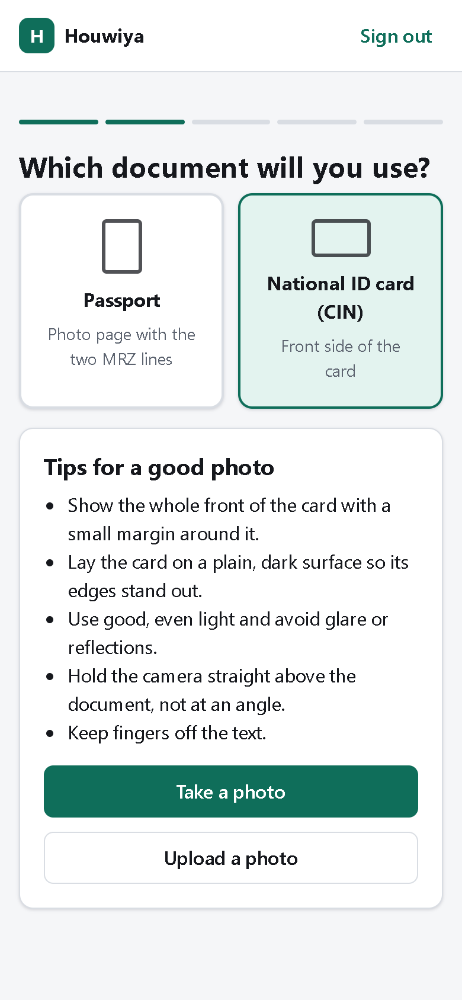
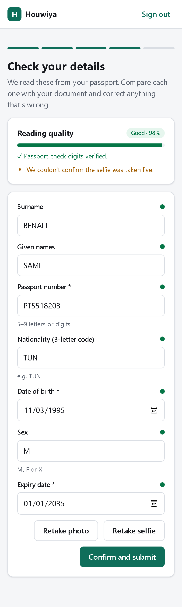
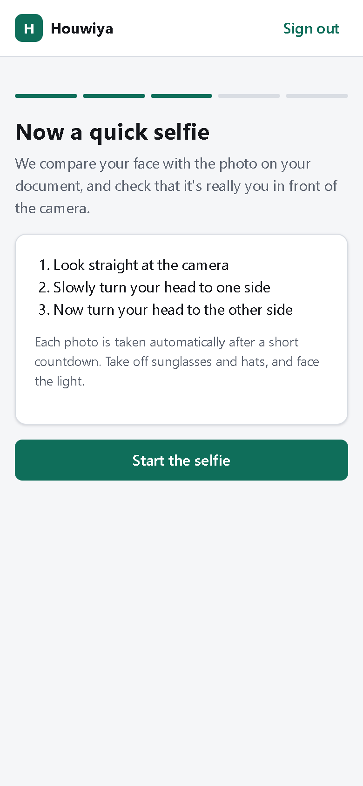
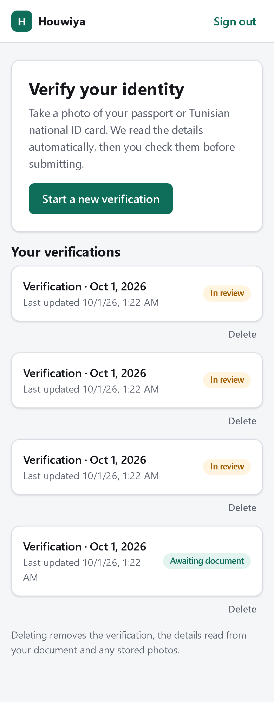
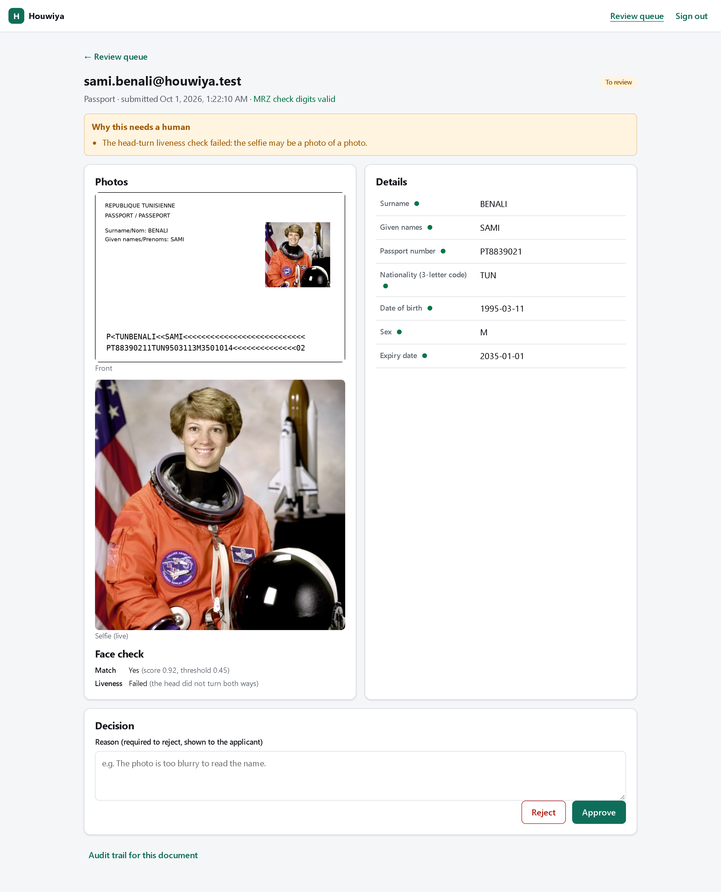
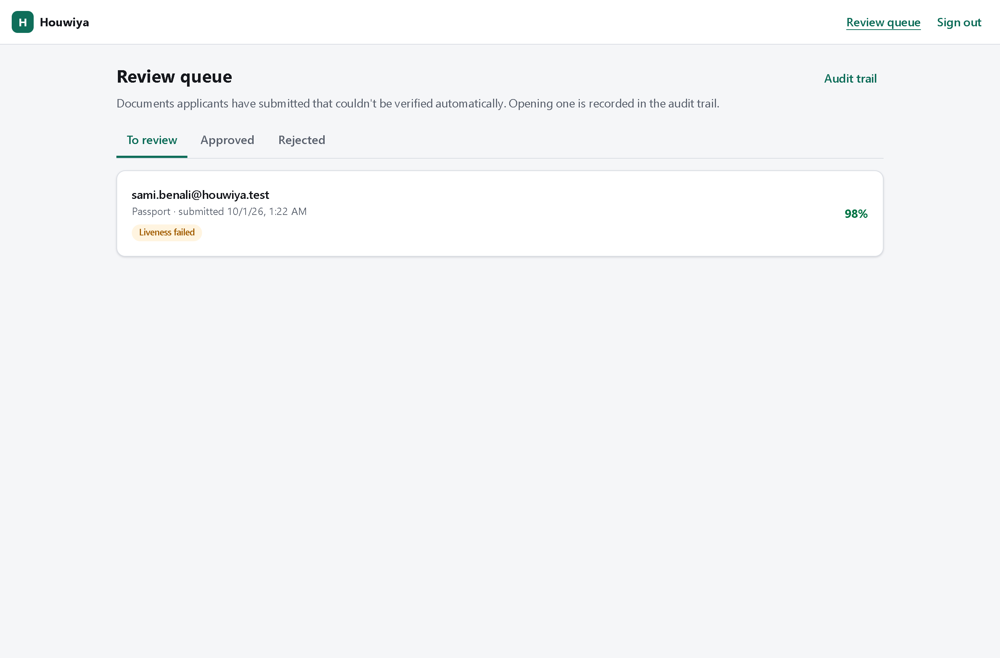
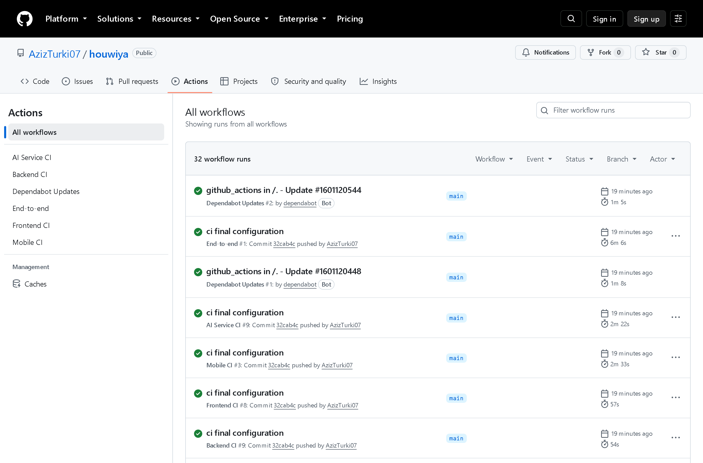

# Houwiya — ID/Passport Onboarding Platform

Scans Tunisian CIN and passport documents during onboarding and extracts data via
an AI/OCR microservice, then matches a selfie against the document photo. See the
project roadmap for the full phase-by-phase plan.

## Screenshots

All data shown is synthetic: a generated passport for a fictional applicant, and NASA's
public-domain portrait of astronaut Eileen Collins as the face. No real document appears.

**Applicant (mobile)**

<p>
  
  
  
  
</p>

1. Choose the document · 2. Check the fields read automatically (confidence, MRZ check
digits) · 3. Selfie with head-turn liveness check · 4. Your verifications and their status

**Reviewer (admin)**

<p>
  
  
</p>

Cases that can't be approved automatically: the document photo next to the selfie, the face
score against the threshold, the liveness result, and approve / reject with a reason.

**Continuous integration**



## Layout

```
backend/       Spring Boot API (auth, onboarding sessions, persistence)
ai-service/    Python FastAPI microservice (passport MRZ + Tunisian CIN OCR)
frontend/      Angular app (capture UI, review screen, admin dashboard)
frontend/android/  Capacitor Android project wrapping the same app (native camera)
k8s/           Kubernetes manifests (Kustomize) + kind scripts to run everything as pods
e2e/           End-to-end check through the public API (synthetic data)
docker-compose.yml
```

## Current status (Phases 2-6 + data protection + selfie face match; Phase 4 accuracy work ongoing)

- Backend: entities (`User`, `OnboardingSession`, `ExtractedDocument`), JWT auth
  (`/api/auth/register`, `/api/auth/login`), and the full onboarding flow wired to the
  AI service over `WebClient`:

  | Endpoint | What it does |
  |---|---|
  | `POST /api/onboarding/sessions` | create a session (`STARTED`) |
  | `POST /api/onboarding/sessions/{id}/consent` | record consent (`CONSENT_GIVEN`) |
  | `POST /api/onboarding/sessions/{id}/document` | multipart `file` + `documentType` (`PASSPORT`/`CIN`) + optional `side` (`FRONT` default, `BACK` for the CIN) -> calls the matching `/extract/...` endpoint, persists the result, session -> `PENDING_REVIEW`. The CIN back is merged into the same document; re-upload before confirming = retake of that side |
  | `GET  /api/onboarding/sessions/{id}/document` | extracted fields + `fieldConfidence`, `ocrConfidence`, `checksumValid`, `warnings`, `backSideRequired`/`backSideCaptured` for the review screen |
  | `POST /api/onboarding/sessions/{id}/selfie` | multipart `frames` x3 (straight, head turned one way, then the other) -> face match against the document portrait + liveness via `/face/verify`. Returns the outcome (`faceMatched`, `livenessPassed`), never the score. Can be retaken until confirmed |
  | `POST /api/onboarding/sessions/{id}/confirm` | `{"fields": {...}}` with the user's reviewed values -> auto-approved if clean, otherwise `NEEDS_REVIEW` for an admin. A CIN needs both sides first, and the selfie is required (`409` otherwise; `FACE_MATCH_REQUIRED=false` turns that off) |

  Warnings that block auto-approval: `LOW_CONFIDENCE` (overall **or any single
  field** below `app.review.min-confidence`, default 0.7), `CHECKSUM_FAILED`, `MISSING_REQUIRED_FIELDS`, `DOCUMENT_EXPIRED`,
  `USER_CORRECTED`, `FACE_MISMATCH`, `FACE_NOT_VERIFIED`, `LIVENESS_FAILED`. A document number already used by another application is rejected
  with `409`. Error codes: `422` unreadable image (prompt a retake), `502` AI service
  down/timeout, `404` session not found or not yours, `409` wrong session state.
  Covered by `OnboardingDocumentFlowTest` (AI client mocked) plus the auth tests.
  > If your local Postgres already has an `extracted_document` table from an earlier
  > run, drop it (or `docker compose down -v`): `extracted_fields_json` changed from
  > `oid` to `text`, which `ddl-auto: update` won't migrate.
- AI service: FastAPI with both pipelines, evaluated on real (consented) documents --
  see [ai-service/eval/REPORT.md](ai-service/eval/REPORT.md) and
  [ai-service/eval/README.md](ai-service/eval/README.md) for numbers and findings.
  - `/extract/passport`: PassportEye locates + OCRs the MRZ; ISO dates, `checksum_valid`
    from the ICAO check digits, `422` if no MRZ is found.
  - `/extract/cin` (front) and `/extract/cin/back`: the real card is Arabic-only. The card
    is found in hand-held photos (fingers over corners, card cut by the frame --
    `card_detection.py`), warped to a canonical size, and each field is read from its own
    row band after an "ink filter" keeps only the black value text (the purple labels,
    background art and stamp are dropped). Dates with Arabic month names
    ("02 اكتوبر 2001") are parsed, digits are re-read with a digits-only model, an
    upside-down photo is retried rotated. Front: number, surname, first name, lineage,
    date/place of birth. Back: profession, address, issue date (the mother's name is
    deliberately not extracted). `422` if no card is found.
  - Every result carries a `field_confidence` map (0-1 per field); a field that fails its
    own validation (check digit, 8-digit number, date) is capped at 0.3.
  - Measured on 8 real consented cards (4 fronts, 4 backs): 58% of CIN fields exact, mean
    character error rate 0.21, CIN number 4/4 -- see the evaluation report for the per-field
    table and what each pipeline step changed. Rows are located per photo, text darkness is
    thresholded per field, married women's cards (lineage on the name line, spouse line
    dropped) are handled, and places/address words/professions get near-miss dictionary
    correction.
  - Tests (54): synthetic CIN fixtures in the real layout incl. a married woman's faded card
    (`tests/generate_cin_fixture.py`, fictitious data), card detection with a thumb over a
    corner / card off the frame, the layout logic, Arabic date parsing, passport rules and
    the expiry-century regression.
- Frontend: Angular 18, full end-to-end flow (lazy-loaded standalone components):
  sign in / register -> my verifications -> consent -> choose passport or CIN ->
  live camera with a document guide (or upload a photo) -> upload progress + "reading
  your document" state -> **editable review screen** (reading-quality meter, fields
  highlighted from the backend `warnings`, a per-field confidence marker with any
  individually hard-to-read field flagged, per-field validation such as 8-digit CIN
  numbers) -> confirm -> verified / submitted-for-review result. A `422` from the AI
  service shows a retake prompt with tips; a `502` offers to retry the same photo;
  an expired JWT signs the user out and returns them to login.
  The API is called through the relative path `/api`, which `ng serve` proxies to
  `localhost:8080` (`frontend/proxy.conf.json`), so the same build works locally and
  behind a Codespaces forwarded URL.

### Running the AI service tests
OCR results depend on the exact Tesseract build, so tests run inside the service image
(this is also what CI does):
```bash
docker build -t houwiya-ai ai-service
docker run --rm houwiya-ai python -m pytest tests/ -v
```

## Mobile app (Android)

The Angular app is wrapped with Capacitor 7 (`frontend/capacitor.config.ts`,
`frontend/android/`). Same screens and flow as the web app; the capture step uses the
phone's own camera and gallery (`@capacitor/camera`) instead of the browser viewfinder,
with photos capped at 2560 px on the long edge and EXIF rotation applied.

**Download a build:** every push touching `frontend/` runs the *Mobile CI* workflow, which
attaches an installable `app-debug.apk` to the run (Actions -> run -> Artifacts).

**Which backend it talks to.** A native app has no dev-server proxy, so the API URL is
compiled in from `MOBILE_API_URL` (default `http://10.0.2.2:8080/api`, the host PC as seen
from the Android emulator):

| Where the backend runs | `MOBILE_API_URL` |
|---|---|
| Your PC, app in the Android emulator | default (`http://10.0.2.2:8080/api`) |
| Your PC, app on a real phone on the same Wi-Fi | `http://<your PC's LAN IP>:8080/api` |
| A Codespace (set port 8080 to **Public** in the Ports tab) | `https://<codespace>-8080.app.github.dev/api` |

For CI builds, set it as the repository variable `MOBILE_API_URL`. Plain-HTTP URLs enable
cleartext traffic in the app (development only); an `https://` backend needs no exception.
The backend's default CORS origins include the app's WebView origins (`https://localhost`
on Android, `capacitor://localhost` on iOS).

**Build locally** (needs the Android SDK and **JDK 21**, e.g. from Android Studio):

```bash
cd frontend
MOBILE_API_URL=http://10.0.2.2:8080/api npm run build:mobile
cd android && ./gradlew assembleDebug    # -> app/build/outputs/apk/debug/app-debug.apk
```

or `npx cap open android` to run it from Android Studio. Codespaces don't include the
Android SDK: use the CI artifact there. iOS would need a Mac (`npx cap add ios`).

## Admin review queue

Documents that can't be auto-approved (any warning: low confidence, failed checksum,
expired, edited by the applicant...) wait in a review queue once the applicant confirms.
An admin sees the photos, every extracted field with its confidence, and exactly what the
applicant changed compared with what the OCR read, then approves or rejects with a reason
the applicant sees (and is e-mailed, once `MAIL_ENABLED=true` and `spring.mail.*` are set).

Registration only creates applicant accounts. The admin account comes from configuration:

```bash
export ADMIN_EMAIL=you@example.com
export ADMIN_PASSWORD='at-least-12-characters'
```

Start the backend with those set; sign in with them and a **Review queue** link appears.
The password is only used to create the account, never to overwrite it later.

Duplicate rule: a document number already used by another person is refused. The same
person may apply again with the same document only after a rejection.

## Selfie face match

After the document photo(s), the applicant takes a selfie with the front camera: three
frames taken automatically after a countdown -- looking straight, then head turned one way,
then the other. The AI service (`POST /face/verify`) then:

1. finds the faces (OpenCV **YuNet**) on the stored document photo and in the frames, and
   compares the portrait with the frontal frame (OpenCV **SFace** embeddings, cosine
   similarity, match at **0.45**);
2. checks liveness: frame 1 frontal, frames 2 and 3 turned in opposite directions (yaw from
   the eye/nose landmarks), exactly one face per frame, and the same person in all three.

Nothing is rejected automatically: a mismatch, a face that couldn't be found, or a failed
liveness check is a warning, so the case goes to a reviewer, who sees the selfie next to
the document with the score and the reason. The applicant only sees the outcome and what
to do differently (retry, or continue and let a person check). Only the frontal frame is
kept, encrypted, under the same retention rules as the document photos.

**How the threshold was chosen** (real, consented documents; no values recorded): the
applicant's CIN portrait against their passport portrait scored 0.72; every pair of
*different* people scored at most 0.35 -- and that maximum was between family members, the
hardest case. 0.45 sits between the two with a margin on both sides. This is a handful of
people, so treat it as a sanity check, not a measured error rate.

**Limits, stated plainly.** The head-turn check stops a printed photo or a still image held
up to the camera. It does not stop a replayed video of the person turning their head, a
3-D mask, or a camera-injection attack; that needs a certified presentation-attack-detection
product. The printed CIN portrait is small and often worn, which lowers similarity for
genuine matches -- one reason doubts go to a person instead of being refused.

Models: YuNet (MIT) and SFace (Apache-2.0) from the OpenCV Zoo, downloaded at image build
time and pinned by SHA-256 in `ai-service/Dockerfile` (~40 MB, not committed). To run the AI
service outside Docker, fetch them once into `ai-service/models/`:

```bash
curl -L -o ai-service/models/face_detection_yunet_2023mar.onnx https://huggingface.co/opencv/face_detection_yunet/resolve/main/face_detection_yunet_2023mar.onnx
curl -L -o ai-service/models/face_recognition_sface_2021dec.onnx https://huggingface.co/opencv/face_recognition_sface/resolve/main/face_recognition_sface_2021dec.onnx
```

The web app uses the browser camera (`getUserMedia`), which needs HTTPS or localhost --
Codespaces forwarded ports are HTTPS, and the Android app's WebView asks for the camera
permission it already declares.

## Security and data protection

| Measure | How |
|---|---|
| Encryption at rest | Document number, date of birth, all extracted fields and the pre-correction values are AES-256-GCM encrypted by the application (`FieldEncryptor`) before they reach Postgres. Duplicate detection uses a keyed HMAC of the number, so no number is stored in clear. |
| Photo retention | Photos are stored (encrypted) only so a reviewer can see flagged documents. They are deleted when a document is auto-approved, when an admin decides, when the applicant deletes the verification, and in any case after 30 days (`app.retention.image-days`, daily clean-up). |
| Right to erasure | Applicants can delete any of their verifications (document, fields and photos) from the app. |
| Audit trail | Registrations, logins (incl. failures), uploads, confirmations, deletions, every admin view of a document or photo, and every decision are logged with who and when -- never with document values. Admins can read it at `/admin/audit`. |
| Rate limiting | 10 login/register attempts per minute per IP; 30 document/selfie uploads per hour per user (`429` + `Retry-After`). |
| Access control | JWT; roles are re-read on every request; `/api/admin/**` needs ADMIN. No token or an invalid one is `401`, not allowed is `403`. |
| Schema | Managed by Flyway migrations (`backend/src/main/resources/db/migration`); Hibernate only validates. |

Relevant for the report: Tunisia's personal-data law (Organic Law 2004-63) requires
consent, purpose limitation, and security of processing -- covered here by the consent
step, not extracting data verification doesn't need (e.g. the mother's name on the CIN),
the retention rules above, encryption and the audit trail.

**Keys and secrets.** `APP_ENCRYPTION_KEY` (base64, 32 bytes: `openssl rand -base64 32`) and
`JWT_SECRET` have public development defaults so the project runs out of the box; the
backend logs a warning while the dev encryption key is in use. Set your own before handling
real documents, and keep the key safe: losing it makes the encrypted data unreadable.

**Upgrading an existing dev database.** The schema is now created by Flyway, which refuses
to take over tables Hibernate created earlier. Reset the local database once:
`docker compose down -v` (this deletes local dev data).

## Running in GitHub Codespaces

The repo has a dev container (`.devcontainer/`) with JDK 21 + Maven, Node 20,
Python 3.12, Tesseract (fra/ara) and Docker-in-Docker; dependencies install on
creation. Pick a **4-core** machine (Maven + OCR + Angular together need the RAM).
Then, one terminal each:

```bash
docker compose up -d postgres ai-service
```
```bash
export ADMIN_EMAIL=you@example.com ADMIN_PASSWORD='choose-12+-characters'
cd backend && mvn spring-boot:run
```
```bash
cd frontend && npm start
```

Open the forwarded **port 4200** URL (Ports tab). Only 4200 needs to be reachable:
the Angular dev server proxies `/api` to the backend inside the Codespace. The
camera works there because forwarded URLs are HTTPS; you can also open the same URL
on your phone (set the port to *Public* first, or sign in to GitHub on the phone)
to test the live capture with a real rear camera.

Backend CORS allows `http://localhost:4200` and `https://*.app.github.dev` by
default; override with `CORS_ALLOWED_ORIGINS` (comma-separated patterns).

## Running everything locally

### Option A: Docker Compose (backend + ai-service + db)
```bash
docker compose up --build
```
- Backend: http://localhost:8080 (Swagger UI at `/swagger-ui.html`)
- AI service: http://localhost:8000 (interactive docs at `/docs`)
- Postgres: localhost:5432 (db `onboarding` / user `onboarding` / pass `onboarding`)

### Option B: Run services individually (better for active development)

**Backend** (needs your own Maven/JDK 21 setup - this sandbox couldn't reach Maven
Central to verify the build, so do a first `mvn clean install` locally to confirm):
```bash
cd backend
mvn spring-boot:run
```

**AI service:**
```bash
cd ai-service
python3 -m venv .venv && source .venv/bin/activate
pip install -r requirements.txt
uvicorn app.main:app --reload --port 8000
```

**Frontend:**
```bash
cd frontend
npm install
npm start     # serves on http://localhost:4200, proxies /api -> localhost:8080
```

## Kubernetes

Everything can run as pods on a local Kubernetes cluster made with
[kind](https://kind.sigs.k8s.io) ("Kubernetes in Docker"). The Codespace has kind and
`kubectl` installed. Plan on about 4 GB of free memory.

```bash
bash k8s/up.sh
```

This creates the cluster (once), builds the three images, deploys them, waits for the
pods and forwards the app to port **4200** (Codespaces: **Ports** tab). The first run takes
several minutes; re-run it after changing code to redeploy. Admin account:
`admin@houwiya.local` / `admin-dev-password`.

| Pod | What it is |
|---|---|
| `postgres-0` | StatefulSet with a 1 Gi volume |
| `ai-service-…` | OCR + face match, health-checked on `/health` |
| `backend-…` | Spring Boot API; waits for Postgres (init container) before starting |
| `frontend-…` | nginx serving the Angular app and proxying `/api` to the backend |

Things to try:

```bash
kubectl -n houwiya get pods -o wide
kubectl -n houwiya logs deploy/backend -f
kubectl -n houwiya scale deploy/frontend --replicas=3
kubectl -n houwiya delete pod -l app=ai-service
```

The last one deletes the AI pod; watch Kubernetes start a new one with
`kubectl -n houwiya get pods -w`. `bash k8s/down.sh` deletes the cluster and its data.

The manifests are in `k8s/base` with two variants:
- `k8s/overlays/local` uses images built in your workspace (what `up.sh` uses);
- `k8s/overlays/ghcr` uses the images published by the **Publish images** workflow:
  `kubectl apply -k k8s/overlays/ghcr`. Make the `houwiya-*` packages public first
  (GitHub profile -> Packages -> package settings).

The secrets in `k8s/base/kustomization.yaml` are **development values** for a local cluster
with synthetic data. Replace them before handling real documents.

## Before you write any real code

1. Set a real `JWT_SECRET` (don't commit it - use an env var or `.env` file).
2. Decide your document-image retention policy (see `rawImagePath` note in
   `ExtractedDocument.java`) before you start persisting real captured images.
3. Only use your own ID / consenting family members' documents for test data -
   never scrape or reuse other people's real ID photos.

## Continuous Integration

Badges for this repository:


The workflows live in `.github/workflows/`. Each one runs when its folders change, and can
also be started by hand: **Actions -> pick the workflow -> Run workflow**.

| Workflow | What it does |
|---|---|
| `backend-ci.yml` | JDK 21 + Maven, `mvn test` against in-memory H2 + Flyway (AI service mocked), then builds the jar |
| `ai-service-ci.yml` | Builds the production AI image (Tesseract fra/ara + face models, layer-cached) and runs `pytest` inside it, so CI tests exactly what ships |
| `frontend-ci.yml` | `npm ci`, `ng build`, Karma unit tests in headless Chrome |
| `mobile-ci.yml` | Builds the Android app; the debug APK is attached to the run (**Artifacts -> houwiya-debug-apk**) |
| `k8s.yml` | Deploys the app to a throwaway Kubernetes cluster (kind) with the same manifests and script as Codespaces, then runs the end-to-end flow against the pods through the frontend's nginx. The **Summary** shows the pods and each step; pod logs and events are attached if it fails |
| `publish-images.yml` | **CD:** builds the backend, AI service and frontend images and publishes them to GitHub Container Registry (`ghcr.io/azizturki07/houwiya-*`, tags `latest` and `sha-…`) on every push to `main` |
| `e2e.yml` | Starts the real stack from `docker-compose.yml` (Postgres + AI service + backend images) and walks the whole flow through the API: passport upload, selfie, confirm, duplicate check, face mismatch, admin review and approval. The step-by-step table appears on the run's **Summary** page; service logs are attached if it fails |

The end-to-end run uses only synthetic passports and public-domain sample faces
(`e2e/make_fixtures.py`). A still photo can't pass the head-turn liveness check, so it
covers match / mismatch / liveness-failed; liveness *passing* is covered by the AI unit tests
and `FaceMatchTest`. To run it on your machine against a fresh database:

```bash
docker compose up -d --build
docker run --rm -v "$PWD/e2e:/e2e" houwiya-ai-service:local python /e2e/make_fixtures.py /e2e/out
ADMIN_EMAIL=... ADMIN_PASSWORD=... python3 e2e/run_e2e.py --api http://localhost:8080/api
```

(The backend must have been started with the same `ADMIN_EMAIL`/`ADMIN_PASSWORD`. Run it
against a fresh database: the synthetic passport can only be used once.)

All jobs use pinned `ubuntu-24.04` runners, read-only repository permissions, and cancel a
run when a newer push supersedes it. Dependabot opens one grouped PR a month when the
actions used have new versions. Both images run as a non-root user.

## Next steps

- Grow the CIN evaluation set further (8 cards today; see `ai-service/eval/README.md`).
- Reduce "confident but wrong" reads, mostly on first names: e.g. cross-check the CIN
  number against the back's barcode, or try PaddleOCR for dates only (it read 8/8).
- Stronger liveness (a certified presentation-attack-detection service) and a larger face
  evaluation set before relying on the match threshold beyond this demo.
- Release signing for the Android app (the CI builds a debug APK) and an iOS build.
- Key rotation for `APP_ENCRYPTION_KEY` (the `v1:` prefix on stored values leaves room).
